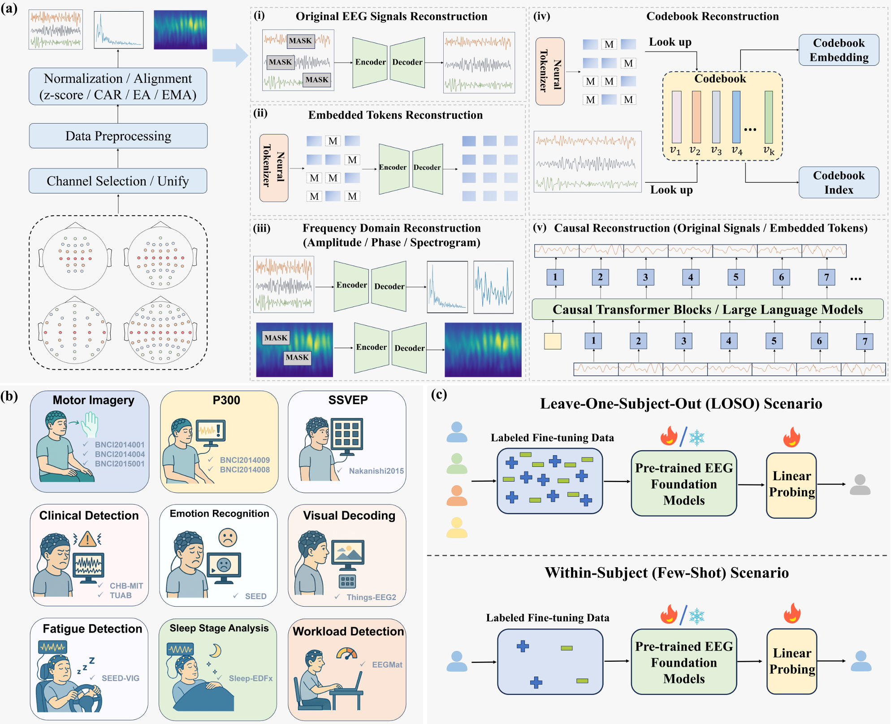
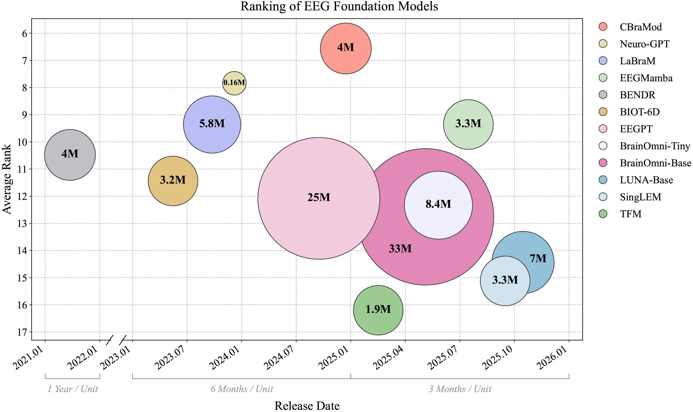

# **🧮EEG-FM-Benchmark**


[](https://arxiv.org/abs/2601.17883)
[](https://huggingface.co/papers/2601.17883)


## :speech_balloon: Annoucement
- [2026.06.15] 🚩 **News:** The benchmark code is now publicly available at [https://github.com/Dingkun0817/EEG-FM-Benchmark](https://github.com/Dingkun0817/EEG-FM-Benchmark).
- [2026.02.06] 🚩 **News:** The manuscript of our benchmark-v2 has been updated in [EEG Foundation Models: Progresses, Benchmarking, and Open Problems](https://arxiv.org/abs/2601.17883). We have added: (1) evaluation of BIOT-1D and BIOT-2D across all scenarios, and (2) experiments with varying fine-tuning data ratios for all models on more datasets.

- [2026.01.27] 🚩 **News:**  The manuscript of our benchmark can be found in [EEG Foundation Models: Progresses, Benchmarking, and Open Problems](https://arxiv.org/abs/2601.17883).

- [2026.01.25] We proposed **fair and comprehensive benchmarking for open source EEG foundation models**.

## 📌 Abstract
Electroencephalography (EEG) foundation models (FMs) have recently emerged as a promising paradigm for brain-computer interfaces, aiming to learn transferable neural representations from large-scale heterogeneous recordings. Despite rapid progress, a fair and comprehensive comparison of existing EEG FMs is still lacking, owing to inconsistent pre-training objectives, preprocessing choices, and downstream evaluation protocols. To fill this gap, we present EEG-FM-Compass. We first review 55 representative models and organize their design choices into a unified taxonomic framework including data standardization, model architectures, and self-supervised pre-training strategies. We then evaluate 12 open source FMs and competitive specialist baselines across 13 EEG datasets spanning nine brain-computer interface paradigms. Emphasizing real-world deployments, we consider both cross-subject generalization under a leave-one-subject-out protocol and rapid calibration under a within-subject few-shot setting. We further compare full-parameter fine-tuning with linear probing to assess the transferability of pre-trained representations, and examine the relationship between model scale and downstream performance. Our results indicate that: 1) linear probing is frequently insufficient; 2) specialist models trained from scratch remain competitive across many tasks; and, 3) larger FMs do not necessarily yield better generalization performance under current data regimes and training practices.

## 🚀  Contributions

**A comprehensive overview of existing BCI foundation models.**
- 🧩 We survey 55 BCI foundation models, constituting the most comprehensive collection to date.
- 🛠️ We provide a detailed and structured comparison of their technical designs, encompassing basic information, pre-training data scale, preprocessing pipelines, pre-training strategies, and architectural choices.
- 🎯 We propose a unified taxonomic framework for EEG foundation models that organizes existing work into a coherent design space.

**Fair and comprehensive benchmarking for open source EEG foundation models.**
- 🧩 We systematically compare "full parameter fine-tuning" with "classification head fine-tuning" across various models and tasks to assess whether pre-trained encoders provide broadly transferable EEG representations. Beyond the commonly used leave one subject out (LOSO) scenario, we introduce a within-subject few-shot adaptation scenario in which the fine-tuning data volume is approximately 1/20 ~ 1/100 of that typically used in LOSO protocols.
- 🛠️ We comprehensively compare traditional machine learning methods, CNN-based models, and Transformer-based models trained from scratch against fine-tuned EEG foundation models to evaluate whether conventional approaches remain competitive.
- 🎯 We evaluate EEG foundation models of varying parameter sizes pre-trained on diverse datasets to investigate whether a larger model necessarily leads to better generalization performance.



## **🧮Benchmarking**
We established a benchmark that evaluates 12 open source EEG foundation models alongside competitive specialist baselines across 13 datasets spanning 9 representative BCI paradigms, under both cross-subject LOSO and within-subject few-shot evaluation protocols.


## 💻 Deployment

### Environment Install
<details>
<summary>Install on Environment</summary> <br/> 
  
- **Python**: 3.10.
- **Dependencies**: See `requirements.txt`. Install with pip after creating a conda environment:

```bash
conda create -n benchmark python=3.10 -y
conda activate benchmark
pip install -r requirements.txt
```

For GPU support, install PyTorch with the appropriate CUDA build from [pytorch.org](https://pytorch.org), then run `pip install -r requirements.txt`.

</details>

## 📈 Quick start

Run all commands from the repository root (directory that contains `run_finetuning.py`). Logs and metrics go under `./outputs/logs/`.


**LOSO for DL baselines (EEGNet on BNCI2014001)**

```bash
python run_finetuning.py \
  --dataset BNCI2014001 \
  --model_name EEGNet \
  --seeds 0 1 2 \
  --gpuid 0 \
  --task_mode Cross \
  --finetune_strategy full \
  --batch_size 32 \
  --epochs 100 \
  --class_weights True \
  --optimizer_type adam \
  --lr 0.001 \
  --weight_decay 0.01 \
  --use_preprocessing_params True \
  --target_fs 250 \
  --l_freq 8.0 \
  --h_freq 32.0 \
  --norm_method car
```

**Few-shot for foundation models, full fine-tuning (CBraMod on BNCI2014001)**

```bash
python run_finetuning.py \
  --dataset BNCI2014001 \
  --model_name CBraMod \
  --seeds 0 1 2 \
  --gpuid 0 \
  --task_mode Fewshot \
  --train_percentage 0.3 \
  --finetune_strategy full \
  --batch_size 16 \
  --epochs 20 \
  --dropout_rate 0.5 \
  --optimizer_type adamw \
  --lr 0.001 \
  --weight_decay 0.1 \
  --layer_decay 1.0 \
  --use_lr_scheduler True \
  --warmup_epochs 5 \
  --min_lr 1e-06 \
  --use_preprocessing_params True \
  --target_fs 200 \
  --l_freq 0.3 \
  --h_freq 75.0 \
  --notch_freq 60.0 \
  --norm_method car \
  --time_length 4.0
```

**Few-shot for foundation model, linear probing (CBraMod on BNCI2014001)**

```bash
python run_finetuning.py \
  --dataset BNCI2014001 \
  --model_name CBraMod \
  --seeds 0 1 2 \
  --gpuid 0 \
  --task_mode Fewshot \
  --train_percentage 0.3 \
  --finetune_strategy head_only \
  --batch_size 16 \
  --epochs 20 \
  --dropout_rate 0.5 \
  --label_smoothing 0.0 \
  --optimizer_type adamw \
  --lr 0.001 \
  --weight_decay 0.1 \
  --use_lr_scheduler True \
  --warmup_epochs 5 \
  --min_lr 1e-06 \
  --min_weight_decay 0.0001 \
  --clip_grad_norm 1.0 \
  --use_preprocessing_params True \
  --target_fs 200 \
  --l_freq 0.3 \
  --h_freq 75.0 \
  --notch_freq 60.0 \
  --norm_method car \
  --time_length 4.0
```

**Traditional ML**

```bash
python run_finetuning.py \
  --dataset BNCI2014001 \
  --model_name CSP_LDA \
  --task_mode Cross \
  --seeds 0 1 2
```

### 🌐 Hyperparameters

The commands above are **reference runs** for specific dataset–model pairs (e.g. CBraMod and EEGNet on BNCI2014001). They are not meant as defaults for every experiment.

In practice, **each dataset and each model usually needs its own hyperparameter search** to reach strong performance. Learning rate, batch size, epochs,  optimizer settings, and preprocessing settings, all interact with data characteristics and model architecture, so there is **no single universal configuration** that works well everywhere.

We encourage you to explore different hyperparameter settings rather than relying on a single fixed recipe.

See `python run_finetuning.py --help` for the full flag list. 

## 📥Datasets

Data is read from `datasets/data/<DatasetName>.pkl`. If a pkl file is missing, the corresponding dataset module (e.g. `datasets/BNCI2014001/Preprocess_Dataset.py`) is used to download or generate it. Supported datasets include:

| Dataset       | BCI Paradigm     | Source |
|---------------|------------------|--------|
| BNCI2014001   | MI               | MOABB |
| BNCI2014004   | MI               | MOABB |
| BNCI2015001   | MI               | MOABB |
| BNCI2014008   | P300             | MOABB |
| BNCI2014009   | P300             | MOABB |
| CHB-MIT       | Clinic           | <https://physionet.org/content/chbmit/1.0.0/> |
| TUAB          | Clinic           | <https://isip.piconepress.com/projects/nedc/html/tuh_eeg/> |
| Sleep-EDFx      | Sleep            | <https://physionet.org/content/sleep-edfx/1.0.0/> |
| SEED          | Emotion          | <https://bcmi.sjtu.edu.cn/home/seed/downloads.html> |
| SEED-VIG      | Fatigue          | <https://bcmi.sjtu.edu.cn/home/seed/seed-vig.html> |
| Nakanishi2015    | SSVEP            | MOABB |
| ThingsEEG2    | Visual decoding  | <https://things-initiative.org/> |
| EEGMAT        | Workload         | <https://physionet.org/content/eegmat/1.0.0/> |

## Main arguments

| Argument              | Description |
|-----------------------|-------------|
| `--dataset`           | Dataset name (e.g. CHB_MIT, BNCI2014001). |
| `--model_name`        | Model name (e.g. BIOT_6D, EEGNet, CSP_LDA). |
| `--task_mode`         | `Cross` or `Fewshot`. |
| `--finetune_strategy` | `full` (all params) or `head_only` (task head only). |
| `--gpuid`             | GPU device ID. |
| `--seeds`             | Random seeds, e.g. `0 1 2`. |
| `--epochs`             | Number of training epochs. |
| `--batch_size`        | Batch size for training and evaluation. |
| `--train_percentage`  | In Fewshot, fraction of each class per subject used for training (default 0.3). |

Run `python run_finetuning.py --help` for all options (optimizer, LR scheduler, preprocessing, etc.).

## 🔍 Models and Checkpoints

### Summary:

- **ML (traditional)**: CSP_LDA, Xdawn_LDA, PSD_Ridge, DE_LDA, TRCA, PSD_LDA, PSD_SVM. These use a separate training/evaluation path and do not require GPU.
- **DL**: EEGNet, ShallowConv, CNNTransformer, Deformer, Conformer, LMDA, FBCNet, MSCFormer, TSception.
- **FM**: LaBraM, BENDR, NeuroGPT, BrainOmni_Tiny, BrainOmni_Base, LUNA_Base, LUNA_Huge, LUNA_Large, EEGMamba, SingLEM, TFMTokenizer, CBraMod, EEGPT, BIOT_6D, BIOT_1D, BIOT_2D.
  
### Open-source repositories for DL and FM models in this benchmark:

| Model | GitHub |
|-------|--------|
| **DL** | |
| EEGNet | <https://github.com/vlawhern/arl-eegmodels> |
| ShallowConv | <https://github.com/braindecode/braindecode> |
| Deformer | <https://github.com/yi-ding-cs/EEG-Deformer> |
| Conformer | <https://github.com/eeyhsong/EEG-Conformer> |
| LMDA | <https://github.com/MiaoZhengQing/LMDA-Code> |
| FBCNet | <https://github.com/ravikiran-mane/FBCNet> |
| MSCFormer | <https://github.com/snailpt/MSCFormer> |
| TSception | <https://github.com/yi-ding-cs/TSception> |
| **FM** | |
| LaBraM | <https://github.com/935963004/LaBraM> |
| BENDR | <https://github.com/SPOClab-ca/BENDR> |
| NeuroGPT | <https://github.com/wenhui0206/NeuroGPT> |
| BrainOmni_Tiny / BrainOmni_Base | <https://github.com/OpenTSLab/BrainOmni> |
| LUNA_Base / LUNA_Huge / LUNA_Large | <https://github.com/pulp-bio/BioFoundation> |
| EEGMamba | <https://github.com/wjq-learning/EEGMamba> |
| SingLEM | <https://github.com/ttlabtuat/SingLEM> |
| TFMTokenizer | <https://github.com/Jathurshan0330/TFM-Tokenizer> |
| CBraMod | <https://github.com/wjq-learning/CBraMod> |
| EEGPT | <https://github.com/BINE022/EEGPT> |
| BIOT_6D / BIOT_1D / BIOT_2D | <https://github.com/ycq091044/BIOT> |

## 🔥Latest EEG-FM Papers
### 🔥2026
- [DeeperBrain: A Neuro-Grounded EEG Foundation Model Towards Universal BCI](https://arxiv.org/abs/2601.06134) (Jan, 2026)
- [EEGMoE: A Domain-Decoupled Mixture-of-Experts Model for Self-Supervised EEG Representation Learning](https://ieeexplore.ieee.org/abstract/document/11357859) (2026, TNNLS)
- [Brain-OF: An Omnifunctional Foundation Model for fMRI, EEG and MEG](https://arxiv.org/abs/2602.23410) (Feb, 2026)
### 🔥2025
- [CEReBrO: Compact Encoder for Representations of Brain Oscillations Using Efficient Alternating Attention](https://arxiv.org/abs/2501.10885) (Jan, 2025)
- [LEAD: LARGE FOUNDATION MODEL FOR EEG-BASEDALZHEIMER’S DISEASE DETECTION](https://arxiv.org/abs/2502.01678) (Feb, 2025)
- [Enhancing EEG Analysis with AI:Developing a Tailored Foundational Model for EEG Signal Classification](https://arxiv.org/abs/2502.06438) (Feb, 2025)
- [Large Cognition Model: Towards Pretrained Electroencephalography (EEG) Foundation Model](https://arxiv.org/abs/2502.17464) (Feb, 2025)
- [TOKENIZING SINGLE-CHANNEL EEG WITH TIME FREQUENCY MOTIF LEARNING](https://arxiv.org/abs/2502.16060) (2025, NeurIPS Workshop)
- [Gram: A Large General EEG Model for Raw Data Classification and Restoration](https://ieeexplore.ieee.org/abstract/document/10890831/) (2025, ICASSP)
- [ALFEE: Adaptive Large Foundation Model for EEGRepresentation](https://arxiv.org/abs/2505.06291) (May, 2025)
- [BrainOmni: A Brain Foundation Model for Unified EEG and MEG Signals](https://arxiv.org/abs/2505.18185) (2025, NeurIPS)
- [EEG Foundation Models for BCI Learn Diverse Features of Electrophysiology ](https://arxiv.org/abs/2506.01867) (Jun, 2025)
- [CodeBrain: TOWARDS DECOUPLED INTERPRETABILITY AND MULTI-SCALE ARCHITECTURE FOR EEG FOUNDATION MODEL](https://arxiv.org/abs/2506.09110) (Jun, 2025)
- [DIVER-0 : A Fully Channel Equivariant EEG Foundation Model](https://arxiv.org/abs/2507.14141) (Jun, 2025)
- [UniMind: Unleashing the Power of LLMs for Unified Multi-Task Brain Decoding](https://arxiv.org/abs/2506.18962) (Jun, 2025)
- [CSBrain: A Cross-scale Spatiotemporal Brain Foundation Model for EEG Decoding](https://arxiv.org/abs/2506.23075) (2025, NeurIPS)
- [DMAE-EEG: A Pretraining Framework for EEG Spatiotemporal Representation Learning](https://ieeexplore.ieee.org/abstract/document/11062976) (2025, TNNLS)
- [EEGMamba: An EEG foundation model with Mamba](https://www.sciencedirect.com/science/article/pii/S0893608025006963) (2025, NN)
- [MIRepNet: A Pipeline and Foundation Model for EEG-Based Motor Imagery Classification](https://arxiv.org/abs/2507.20254) (Jul, 2025)
- [Foundation Models Reveal Untapped Health Information in Human Polysomnographic Sleep Data](https://www.medrxiv.org/content/10.1101/2025.07.15.25331562v2) (2025, RBME)
- [EEGDM: EEG Representation Learning via Generative Diffusion Model](https://arxiv.org/abs/2508.14086) (Aug, 2025)
- [CoMET:AContrastive-Masked Brain Foundation Model for Universal EEG Representation](https://arxiv.org/abs/2509.00314) (Aug, 2025)
- [EpilepsyFM: A domain-specific foundation model for epileptic representation learning using EEG signals](https://www.sciencedirect.com/science/article/pii/S0893608025009402) (2025, NN)
- [SingLEM: Single-Channel Large EEG Model](https://arxiv.org/abs/2509.17920) (Sep, 2025)
- [BRAINPRO: TOWARDS LARGE-SCALE BRAIN STATE-AWARE EEG REPRESENTATION LEARNING](https://arxiv.org/abs/2509.22050) (Sep, 2025)
- [UNI-NTFM: A UNIFIED FOUNDATION MODEL FOR EEG SIGNAL REPRESENTATION LEARNING](https://arxiv.org/abs/2509.24222) (Sep, 2025)
- [ELASTIQ: EEG–LANGUAGE ALIGNMENT WITH SEMANTIC TASK INSTRUCTION AND QUERYING](https://arxiv.org/abs/2509.24302) (Sep, 2025)
- [Neural Codecs as Biosignal Tokenizers](https://arxiv.org/abs/2510.09095) (Oct, 2025)
- [HEAR: AN EEG FOUNDATION MODEL WITH HETEROGENEOUS ELECTRODE ADAPTIVE REPRESENTATION](https://arxiv.org/abs/2510.12515) (Oct, 2025)
- [NEURORVQ: MULTI-SCALE EEG TOKENIZATION FOR GENERATIVE LARGE BRAIN WAVE MODELS](https://arxiv.org/abs/2510.13068) (Oct, 2025)
- [NeurIPT: Foundation Model for Neural Interfaces](https://proceedings.neurips.cc/paper_files/paper/2025/hash/dd9c5ce8803e1898d438e636fbae0236-Abstract-Conference.html) (2025, NeurIPS)
- [REVE: AFoundation Model for EEG Adapting to Any Setup with Large-Scale Pretraining on 25,000 Subjects](https://arxiv.org/abs/2510.21585) (2025, NeurIPS)
- [Multi-dataset Joint Pre-training of Emotional EEG Enables Generalizable Affective Computing](https://arxiv.org/abs/2510.22197) (Oct, 2025)
- [LUNA:Efficient and Topology-Agnostic Foundation Model for EEG Signal Analysis](https://arxiv.org/abs/2510.22257) (Oct, 2025)
- [THD-BAR: Topology Hierarchical Derived Brain Autoregressive Modeling for EEG Generic Representations](https://arxiv.org/abs/2511.13733) (2025, NeurIPS)
- [EEG-X: DEVICE-AGNOSTIC ANDNOISE-ROBUST FOUNDATION MODEL FOR EEG](https://arxiv.org/abs/2511.08861) (Nov, 2025)
- [SAMBA: TOWARD A LONG-CONTEXT EEG FOUNDATION MODEL VIA SPATIAL EMBEDDING AND DIFFERENTIAL MAMBA](https://arxiv.org/abs/2511.18571) (Nov, 2025)
### 🔥2024
- [EEGFormer: Towards Transferable and Interpretable Large-Scale EEG Foundation Model](https://openreview.net/forum?id=MXRy6bYBfB) (2024, AAAI SSS)
- [BrainWave: A Brain Signal Foundation Model for Clinical Applications](https://arxiv.org/abs/2402.10251) (Feb, 2024)
- [NEUROLM: AUNIVERSAL MULTI-TASK FOUNDATION MODEL FOR BRIDGING THE GAP BETWEEN LANGUAGE AND EEG SIGNALS](https://openreview.net/forum?id=Io9yFt7XH7) (2025, ICLR)
- [Brant-X:AUnifiedPhysiological Signal Alignment Framework](https://dl.acm.org/doi/abs/10.1145/3637528.3671953) (2024, KDD)
- [FoME: A Foundation Model for EEG using Adaptive Temporal-Lateral Attention Scaling](https://arxiv.org/abs/2409.12454) (Sep, 2024)
- [EEGPT: Pretrained Transformer for Universal and Reliable Representation of EEG Signals](https://proceedings.neurips.cc/paper_files/paper/2024/hash/4540d267eeec4e5dbd9dae9448f0b739-Abstract-Conference.html) (2024, NeurIPS)
- [BrainGPT: Unleashing the Potential of EEG Generalist Foundation Model by Autoregressive Pre-training](https://arxiv.org/abs/2510.16658) (Oct, 2024)
- [GEFM: Graph-Enhanced EEG Foundation Model](https://ieeexplore.ieee.org/abstract/document/11254706) (2025, EMBC)
- [CBRAMOD: A CRISS-CROSS BRAIN FOUNDATION MODEL FOR EEG DECODING](https://openreview.net/forum?id=NPNUHgHF2w) (2025, ICLR)
### 🔥2023
- [MBrain: A Multi-channel Self-Supervised Learning Framework for Brain Signals](https://dl.acm.org/doi/abs/10.1145/3580305.3599426) (2023, KDD)
- [BIOT: Biosignal Transformer for Cross-data Learning in the Wild](https://proceedings.neurips.cc/paper_files/paper/2023/hash/f6b30f3e2dd9cb53bbf2024402d02295-Abstract-Conference.html) (2023, NeurIPS)
- [Brant: Foundation Model for Intracranial Neural Signal](https://proceedings.neurips.cc/paper_files/paper/2023/hash/535915d26859036410b0533804cee788-Abstract-Conference.html) (2023, NeurIPS)
- [Large Brain Model for Learning Generic Representations with Tremendous EEG Data in BCI](https://openreview.net/forum?id=QzTpTRVtrP) (2024, ICLR)
- [MENTALITY: A MAMBA-BASED APPROACH TOWARDS FOUNDATION MODELS FOR EEG](https://openreview.net/forum?id=O6T38rRiFp) (2024, ICLR Workshop)
- [NEURO-GPT: TOWARDSAFOUNDATIONMODELFOREEG](https://ieeexplore.ieee.org/abstract/document/10635453) (2024, ISBI)
- [MEET: A Multi-Band EEG Transformer for Brain States Decoding](https://ieeexplore.ieee.org/abstract/document/10345766) (2024, TBME)
### 🔥2022
- [BRAINBERT: SELF-SUPERVISED REPRESENTATION LEARNING FOR INTRACRANIAL RECORDINGS](https://openreview.net/forum?id=xmcYx_reUn6) (2023, ICLR)
### 🔥2021
- [BENDR: Using Transformers and a Contrastive Self-Supervised Learning Task to Learn From Massive Amounts of EEG Data](https://www.frontiersin.org/journals/human-neuroscience/articles/10.3389/fnhum.2021.653659/full) (2021, Front.Hum.Neuro.)

## 📩 Contact
For any questions, suggestions or collaborations, please feel free to reach out via `liudingkun@hust.edu.cn` or open an issue in this repository.

## Citation
If you find our repo useful for your research, please cite us:
```
@article{liu2026eeg,
  title={EEG Foundation Models: Progresses, Benchmarking, and Open Problems},
  author={Liu, Dingkun and Chen, Yuheng and Chen, Zhu and Cui, Zhenyao and Wen, Yaozhi and An, Jiayu and Luo, Jingwei and Wu, Dongrui},
  journal={arXiv preprint arXiv:2601.17883},
  year={2026}
}
```
