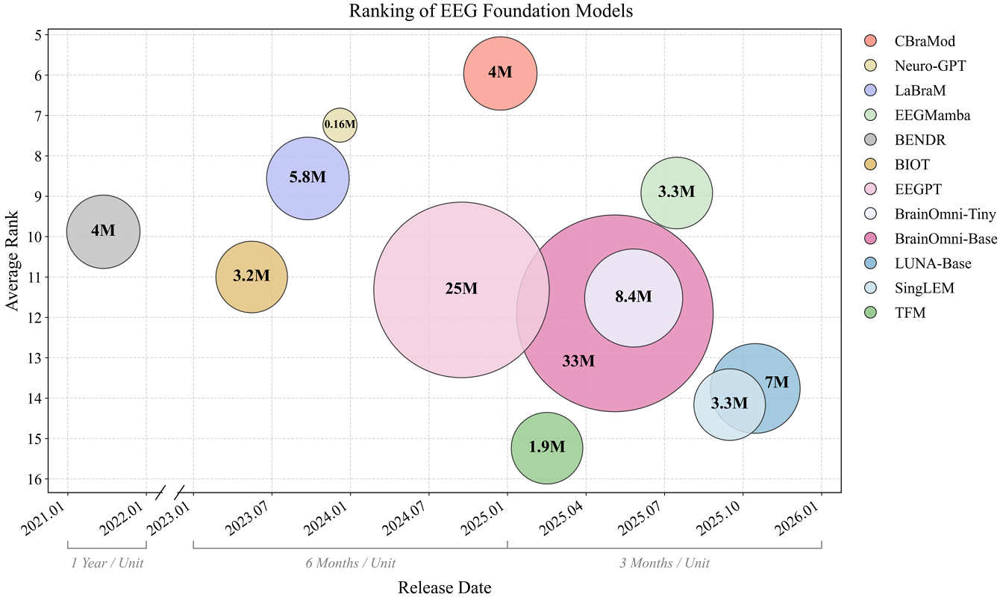

# **🧮EEG-FM-Benchmark**

## :speech_balloon: Annoucement
- [2026.01.27] 🚩 **News**  The manuscript of our benchmark can be found in [EEG Foundation Models: Progresses, Benchmarking, and Open Problems](https://arxiv.org/abs/2601.17883).

- [2026.01.25] We propose **fair and comprehensive benchmarking for open source EEG foundation models**.

## 📌 Abstract
Electroencephalography (EEG) foundation models have recently emerged as a promising paradigm for brain-computer interfaces (BCIs), aiming to learn transferable neural representations from large-scale heterogeneous recordings. Despite rapid progresses, there lacks fair and comprehensive comparisons of existing EEG foundation models, due to inconsistent pre-training objectives, preprocessing choices, and downstream evaluation protocols. This paper fills this gap. We first review 50 representative models and organize their design choices into a unified taxonomic framework including data standardization, model architectures, and self-supervised pre-training strategies. We then evaluate 12 open-source foundation models and competitive specialist baselines across 13 EEG datasets spanning nine BCI paradigms. Emphasizing real-world deployments, we consider both cross-subject generalization under a leave-one-subject-out protocol and rapid calibration under a within-subject few-shot setting. We further compare full-parameter fine-tuning with linear probing to assess the transferability of pre-trained representations, and examine the relationship between model scale and downstream performance. Our results indicate that: 1) linear probing is frequently insufficient; 2) specialist models trained from scratch remain competitive across many tasks; and, 3) larger foundation models do not necessarily yield better generalization performance under current data regimes and training practices.

## 🚀  Contributions

**A comprehensive overview of existing BCI foundation models.**
- 🧩 We survey 50 BCI foundation models, constituting the most comprehensive collection to date.
- 🛠️ We provide a detailed and structured comparison of their technical designs, encompassing basic information, pre-training data scale, preprocessing pipelines, pre-training strategies, and architectural choices.
- 🎯 We propose a unified taxonomic framework for EEG foundation models that organizes existing work into a coherent design space.

**Fair and comprehensive benchmarking for open source EEG foundation models.**
- 🧩 We systematically compare "full parameter fine-tuning" with "classification head fine-tuning" across various models and tasks to assess whether pre-trained encoders provide broadly transferable EEG representations. Beyond the commonly used leave one subject out (LOSO) scenario, we introduce a within-subject few-shot adaptation scenario in which the fine-tuning data volume is approximately 1/20 ~ 1/100 of that typically used in LOSO protocols.
- 🛠️ We comprehensively compare traditional machine learning methods, CNN-based models, and Transformer-based models trained from scratch against fine-tuned EEG foundation models to evaluate whether conventional approaches remain competitive.
- 🎯 We evaluate EEG foundation models of varying parameter sizes pre-trained on diverse datasets to investigate whether a larger model necessarily leads to better generalization performance.

## 🔥Latest EEG-FM Papers
### 🔥2026
- [DeeperBrain: A Neuro-Grounded EEG Foundation Model Towards Universal BCI](https://arxiv.org/abs/2601.06134) (Jan, 2026)
### 🔥2025
- [CEReBrO: Compact Encoder for Representations of Brain Oscillations Using Efficient Alternating Attention](https://arxiv.org/abs/2501.10885) (Jan, 2025)
- [LEAD: LARGE FOUNDATION MODEL FOR EEG-BASEDALZHEIMER’S DISEASE DETECTION](https://arxiv.org/abs/2502.01678) (Feb, 2025)
- [Enhancing EEG Analysis with AI:Developing a Tailored Foundational Model for EEG Signal Classification](https://arxiv.org/abs/2502.06438) (Feb, 2025)
- [Large Cognition Model: Towards Pretrained Electroencephalography (EEG) Foundation Model](https://arxiv.org/abs/2502.17464) (Feb, 2025)
- [TOKENIZING SINGLE-CHANNEL EEG WITH TIME FREQUENCY MOTIF LEARNING](https://arxiv.org/abs/2502.16060) (2025, NeurIPS Workshop)
- [ALFEE: Adaptive Large Foundation Model for EEGRepresentation](https://arxiv.org/abs/2505.06291) (May, 2025)
- [BrainOmni: A Brain Foundation Model for Unified EEG and MEG Signals](https://arxiv.org/abs/2505.18185) (2025, NeurIPS)
- [EEG Foundation Models for BCI Learn Diverse Features of Electrophysiology ](https://arxiv.org/abs/2506.01867) (Jun, 2025)
- [CodeBrain: TOWARDS DECOUPLED INTERPRETABILITY AND MULTI-SCALE ARCHITECTURE FOR EEG FOUNDATION MODEL](https://arxiv.org/abs/2506.09110) (Jun, 2025)
- [UniMind: Unleashing the Power of LLMs for Unified Multi-Task Brain Decoding](https://arxiv.org/abs/2506.18962) (Jun, 2025)
- [CSBrain: A Cross-scale Spatiotemporal Brain Foundation Model for EEG Decoding](https://arxiv.org/abs/2506.23075) (2025, NeurIPS)
- [DMAE-EEG: A Pretraining Framework for EEG Spatiotemporal Representation Learning](https://ieeexplore.ieee.org/abstract/document/11062976) (2025, TNNLS)
- [EEGMamba: An EEG foundation model with Mamba](https://www.sciencedirect.com/science/article/pii/S0893608025006963) (2025, NN)
- [MIRepNet: A Pipeline and Foundation Model for EEG-Based Motor Imagery Classification](https://arxiv.org/abs/2507.20254) (Jul, 2025)
- [Foundation Models Reveal Untapped Health Information in Human Polysomnographic Sleep Data](https://www.medrxiv.org/content/10.1101/2025.07.15.25331562v2) (2025, RBME)
- [EEGDM: EEG Representation Learning via Generative Diffusion Model](https://arxiv.org/abs/2508.14086) (Aug, 2025)
- [CoMET:AContrastive-Masked Brain Foundation Model for Universal EEG Representation](https://arxiv.org/abs/2509.00314) (Aug, 2025)
- [EpilepsyFM: A domain-specific foundation model for epileptic representation learning using EEG signals](https://www.sciencedirect.com/science/article/pii/S0893608025009402) (2025, NN)
- [SingLEM: Single-Channel Large EEG Model](https://arxiv.org/abs/2509.17920) (Sep, 2025)
- [BRAINPRO: TOWARDS LARGE-SCALE BRAIN STATE-AWARE EEG REPRESENTATION LEARNING](https://arxiv.org/abs/2509.22050) (Sep, 2025)
- [UNI-NTFM: A UNIFIED FOUNDATION MODEL FOR EEG SIGNAL REPRESENTATION LEARNING](https://arxiv.org/abs/2509.24222) (Sep, 2025)
- [ELASTIQ: EEG–LANGUAGE ALIGNMENT WITH SEMANTIC TASK INSTRUCTION AND QUERYING](https://arxiv.org/abs/2509.24302) (Sep, 2025)
- [Neural Codecs as Biosignal Tokenizers](https://arxiv.org/abs/2510.09095) (Oct, 2025)
- [HEAR: AN EEG FOUNDATION MODEL WITH HETEROGENEOUS ELECTRODE ADAPTIVE REPRESENTATION](https://arxiv.org/abs/2510.12515) (Oct, 2025)
- [NEURORVQ: MULTI-SCALE EEG TOKENIZATION FOR GENERATIVE LARGE BRAIN WAVE MODELS](https://arxiv.org/abs/2510.13068) (Oct, 2025)
- [REVE: AFoundation Model for EEG Adapting to Any Setup with Large-Scale Pretraining on 25,000 Subjects](https://arxiv.org/abs/2510.21585) (2025, NeurIPS)
- [Multi-dataset Joint Pre-training of Emotional EEG Enables Generalizable Affective Computing](https://arxiv.org/abs/2510.22197) (Oct, 2025)
- [LUNA:Efficient and Topology-Agnostic Foundation Model for EEG Signal Analysis](https://arxiv.org/abs/2510.22257) (Oct, 2025)
- [THD-BAR: Topology Hierarchical Derived Brain Autoregressive Modeling for EEG Generic Representations](https://arxiv.org/abs/2511.13733) (2025, NeurIPS)
- [EEG-X: DEVICE-AGNOSTIC ANDNOISE-ROBUST FOUNDATION MODEL FOR EEG](https://arxiv.org/abs/2511.08861) (Nov, 2025)
- [SAMBA: TOWARD A LONG-CONTEXT EEG FOUNDATION MODEL VIA SPATIAL EMBEDDING AND DIFFERENTIAL MAMBA](https://arxiv.org/abs/2511.18571) (Nov, 2025)
### 🔥2024
- [EEGFormer: Towards Transferable and Interpretable Large-Scale EEG Foundation Model](https://openreview.net/forum?id=MXRy6bYBfB) (2024, AAAI SSS)
- [BrainWave: A Brain Signal Foundation Model for Clinical Applications](https://arxiv.org/abs/2402.10251) (Feb, 2024)
- [NEUROLM: AUNIVERSAL MULTI-TASK FOUNDATION MODEL FOR BRIDGING THE GAP BETWEEN LANGUAGE AND EEG SIGNALS](https://openreview.net/forum?id=Io9yFt7XH7) (2025, ICLR)
- [Brant-X:AUnifiedPhysiological Signal Alignment Framework](https://dl.acm.org/doi/abs/10.1145/3637528.3671953) (2024, KDD)
- [FoME: A Foundation Model for EEG using Adaptive Temporal-Lateral Attention Scaling](https://arxiv.org/abs/2409.12454) (Sep, 2024)
- [EEGPT: Pretrained Transformer for Universal and Reliable Representation of EEG Signals](https://proceedings.neurips.cc/paper_files/paper/2024/hash/4540d267eeec4e5dbd9dae9448f0b739-Abstract-Conference.html) (2024, NeurIPS)
- [BrainGPT: Unleashing the Potential of EEG Generalist Foundation Model by Autoregressive Pre-training](https://arxiv.org/abs/2510.16658) (Oct, 2024)
- [GEFM: Graph-Enhanced EEG Foundation Model](https://ieeexplore.ieee.org/abstract/document/11254706) (2025, EMBC)
- [CBRAMOD: A CRISS-CROSS BRAIN FOUNDATION MODEL FOR EEG DECODING](https://openreview.net/forum?id=NPNUHgHF2w) (2025, ICLR)
### 🔥2023
- [MBrain: A Multi-channel Self-Supervised Learning Framework for Brain Signals](https://dl.acm.org/doi/abs/10.1145/3580305.3599426) (2023, KDD)
- [BIOT: Biosignal Transformer for Cross-data Learning in the Wild](https://proceedings.neurips.cc/paper_files/paper/2023/hash/f6b30f3e2dd9cb53bbf2024402d02295-Abstract-Conference.html) (2023, NeurIPS)
- [Brant: Foundation Model for Intracranial Neural Signal](https://proceedings.neurips.cc/paper_files/paper/2023/hash/535915d26859036410b0533804cee788-Abstract-Conference.html) (2023, NeurIPS)
- [Large Brain Model for Learning Generic Representations with Tremendous EEG Data in BCI](https://openreview.net/forum?id=QzTpTRVtrP) (2024, ICLR)
- [MENTALITY: A MAMBA-BASED APPROACH TOWARDS FOUNDATION MODELS FOR EEG](https://openreview.net/forum?id=O6T38rRiFp) (2024, ICLR Workshop)
- [NEURO-GPT: TOWARDSAFOUNDATIONMODELFOREEG](https://ieeexplore.ieee.org/abstract/document/10635453) (2024, ISBI)
- [MEET: A Multi-Band EEG Transformer for Brain States Decoding](https://ieeexplore.ieee.org/abstract/document/10345766) (2024, TBME)
### 🔥2022
- [BRAINBERT: SELF-SUPERVISED REPRESENTATION LEARNING FOR INTRACRANIAL RECORDINGS](https://openreview.net/forum?id=xmcYx_reUn6) (2023, ICLR)
### 🔥2021
- [BENDR: Using Transformers and a Contrastive Self-Supervised Learning Task to Learn From Massive Amounts of EEG Data](https://www.frontiersin.org/journals/human-neuroscience/articles/10.3389/fnhum.2021.653659/full) (2021, Front.Hum.Neuro.)

